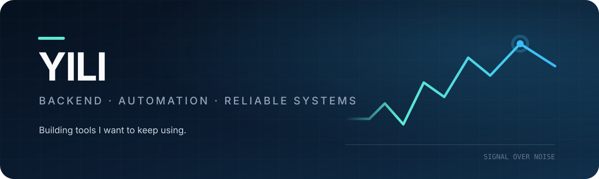

  

  Computer Science @ NTOU &nbsp;·&nbsp; Backend engineering &nbsp;·&nbsp; Taiwan

  <a href="https://github.com/Yili-code/Crypto-Flash">Crypto Flash</a> ·
  <a href="https://github.com/Yili-code/WelfareBridge">WelfareBridge</a> ·
  <a href="https://github.com/Yili-code/Chronos">Chronos</a> ·
  <a href="https://github.com/Yili-code/News-Agent">News Agent</a>

## About me

I mainly work with Python and backend systems. Most of my projects start with a problem I have myself, then grow as I run into the less exciting—but important—parts: retries, queues, state, deployment, and tests.

I use AI when it is useful, but I care just as much about what happens when an external service is slow, unavailable, or returns something unexpected.

## Featured project · Crypto Flash

> A crypto-news monitor that cuts through noisy feeds and delivers the updates I want to see on Telegram.

[**Crypto Flash**](https://github.com/Yili-code/Crypto-Flash) is the project I use and maintain most often. It is also where I have done most of my work around long-running services and failure recovery.

| Ingestion | Runtime | Delivery |
| --- | --- | --- |
| WebSocket reconnects and idle-timeout recovery | Bounded queues and back-pressure control | Telegram throttling and rate-limit retries |
| News and YouTube feed monitoring | Persistent state across scheduled runs | Search, daily digests, and event timelines |

`Python` `asyncio` `WebSockets` `Telegram Bot API` `GitHub Actions` `pytest`

**[View the repository →](https://github.com/Yili-code/Crypto-Flash)**

## More things I've built

| Project | What I built |
| --- | --- |
| **[WelfareBridge](https://github.com/Yili-code/WelfareBridge)** | A full-stack service that matches users with public benefits using official-source crawlers and rule-based eligibility checks. |
| **[Chronos](https://github.com/Yili-code/Chronos)** | A Telegram-first project and task assistant with reminders, repository status, and a small web dashboard. |
| **[News Agent](https://github.com/Yili-code/News-Agent)** | An RSS collector that removes duplicate stories and sends a daily Telegram briefing. |

## Toolbox

**Backend** &nbsp; `Python` `FastAPI` `REST APIs`  
**Data** &nbsp;&nbsp;&nbsp;&nbsp;&nbsp;&nbsp; `SQLite` `MongoDB` `Redis`  
**Delivery** &nbsp; `Docker` `GitHub Actions` `Telegram Bot API`  
**Quality** &nbsp;&nbsp;&nbsp; `pytest` `unittest` `Ruff`

---

  Currently preparing for a backend engineering internship. 
  I am improving these projects one small, tested change at a time.

