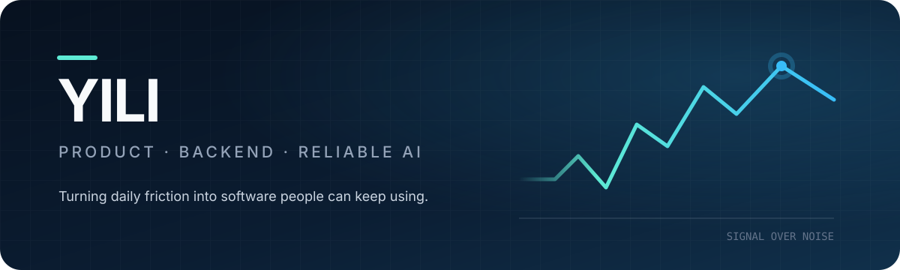

  

  Computer Science @ NTOU &nbsp;·&nbsp; Product-minded backend builder &nbsp;·&nbsp; Taiwan

  <a href="https://github.com/Yili-code/Crypto-Flash">Crypto Flash</a> ·
  <a href="https://github.com/Yili-code/Mnemosyne">Mnemosyne</a> ·
  <a href="https://github.com/Yili-code/News-Agent">News Agent</a> ·
  <a href="mailto:yili.code@gmail.com">Email</a>

## What I build

I turn problems I encounter in daily life into reliable, AI-powered tools. I like the part after the demo works: deciding what matters, handling failure, operating the system, and learning from real use.

AI is leverage, not the product. I care about what happens when a provider is slow, a scheduled job is delayed, state must survive another run, or an automated message is not useful enough to keep.

## Featured project · Crypto Flash

> Real-time market context for a Telegram group without the raw-feed noise.

[**Crypto Flash**](https://github.com/Yili-code/Crypto-Flash) has been running for about two months in a 10-member Telegram group. I use the group as a small, real operating environment: observe how information lands, propose improvements, and refine the delivery format with the people receiving it.

| Ingestion | Runtime | Delivery |
| --- | --- | --- |
| WebSocket reconnects and idle-timeout recovery | Bounded queues and back-pressure control | Telegram throttling and rate-limit retries |
| News, RSS, and YouTube monitoring | Persistent state across scheduled runs | Search, daily digests, and event timelines |

`Python` `asyncio` `WebSockets` `Gemini API` `Telegram Bot API` `GitHub Actions` `pytest`

**[Read the case study in the repository →](https://github.com/Yili-code/Crypto-Flash)**

## Three problems, three time horizons

| Project | Problem | Time horizon | Current evidence |
| --- | --- | --- | --- |
| **[Crypto Flash](https://github.com/Yili-code/Crypto-Flash)** | Turn high-volume crypto and macro updates into timely context | Minutes | Operating for about two months in a 10-member Telegram group |
| **[News Agent](https://github.com/Yili-code/News-Agent)** | Compress software, AI, and startup news into a focused briefing | Daily | Scheduled pipeline with persisted history and Telegram delivery |
| **[Mnemosyne](https://github.com/Yili-code/Mnemosyne)** | Turn words I encounter into structured cards and spaced review | Days to months | Deployed, owner-only alpha that I use myself |

Together, they explore one recurring question: **how can a small system turn noisy inputs into useful action at the right time?**

## How I work

I work best when I can help define the problem, challenge assumptions, and own delivery—not only implement a predetermined solution. I prefer small, testable changes; explicit failure boundaries; and claims that match the available evidence.

**Backend** &nbsp; `Python` `FastAPI` `REST APIs` 
**Data** &nbsp;&nbsp;&nbsp;&nbsp;&nbsp;&nbsp; `SQLite` `Firestore` `Redis` 
**Delivery** &nbsp; `Docker` `GitHub Actions` `Google Cloud Run` `Telegram Bot API` 
**Quality** &nbsp;&nbsp;&nbsp; `pytest` `unittest` `Ruff`

## Let's build

I am open to early-stage product collaborations, technical co-founder conversations, and backend engineering opportunities with people who care about shipping useful software.

**Contact:** [yili.code@gmail.com](mailto:yili.code@gmail.com)
